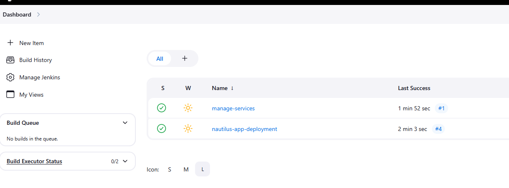
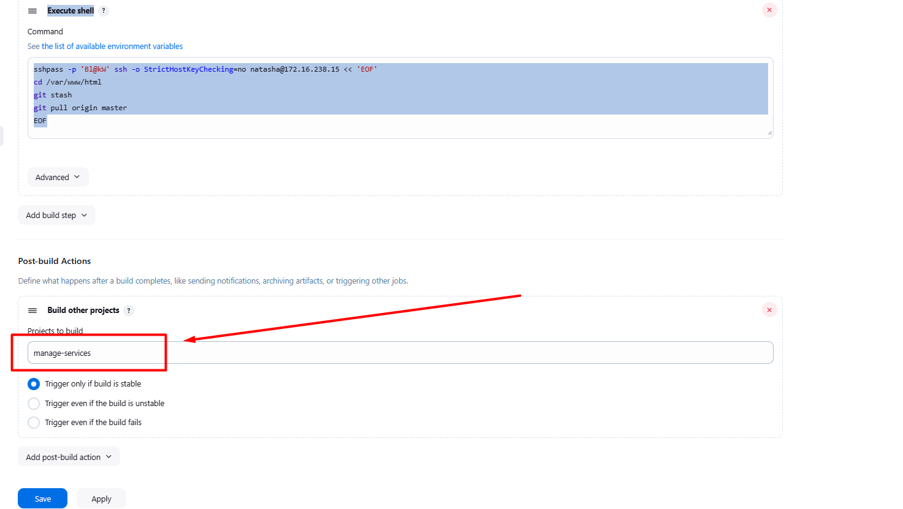

Apache is already installed and configured on all app server so no changes are needed there. The doc root `/var/www/html` on all these app servers is shared among the Storage server under `/var/www/html` directory.

1. Create a Jenkins job named `nautilus-app-deployment` and configure it to pull change from the `master` branch of `web` repository on `Storage server` under `/var/www/html` directory, which is already a local git repository tracking the origin `web` repository. Since `/var/www/html` on `Storage server` is a shared volume so changes should auto reflect on all apps.

2. Create another Jenkins job named `manage-services` and make it a `downstream job` for `nautilus-app-deployment` job. Things to take care about this job are:

a. This job should restart `httpd` service on all app servers.

b. Trigger this job only if the `upstream job` i.e `nautilus-app-deployment` is stable.

`LB` server is already configured. Click on the `App` button on the top bar to access the app. You should be able to see the latest changes you made. Please make sure the required content is loading on the main URL `https://<LBR-URL>` i.e there should not be a sub-directory like `https://<LBR-URL>/web` etc.

---

# Solution:

## Step-by-Step Solution





## Create the First Job - `nautilus-app-deployment`

1. From Jenkins Dashboard, click **New Item**
2. Enter name: `nautilus-app-deployment`
3. Select **Freestyle project**
4. Click **OK**

**Configure the job:**

**General:**

- Description: `Pull changes from web repository on Storage server`

**Build Steps:**

- Click **Add build step** → Execute shell

```
sshpass -p 'Bl@kW' ssh -o StrictHostKeyChecking=no natasha@172.16.238.15 << 'EOF'
cd /var/www/html
git stash
git pull origin master
EOF
```
**Post-build Actions:**


- Click **Add post-build action** → **Build other projects**
- Projects to build: `manage-services`
- Check **Trigger only if build is stable**



1. Click **Save**

## Step 5: Create the Second Job - `manage-services`

1. From Jenkins Dashboard, click **New Item**
2. Enter name: `manage-services`
3. Select **Freestyle project**
4. Click **OK**

**Configure the job:**

**General:**

- Description: `Restart httpd service on all app servers`

**Build Steps:**

- Click **Add build step** → Execute shell

```
sshpass -p 'Ir0nM@n' ssh -o StrictHostKeyChecking=no tony@172.16.238.10 << 'EOF'
echo 'Ir0nM@n' | sudo -S systemctl restart httpd
EOF
sshpass -p 'Am3ric@' ssh -o StrictHostKeyChecking=no steve@172.16.238.11 << 'EOF'
echo 'Am3ric@' | sudo -S systemctl restart httpd
EOF

sshpass -p 'BigGr33n' ssh -o StrictHostKeyChecking=no banner@172.16.238.12 << 'EOF'
echo 'BigGr33n' | sudo -S systemctl restart httpd
EOF
```


## Summary of the Flow:

1. **nautilus-app-deployment** job pulls code from `http://git.stratos.xfusioncorp.com/sarah/web.git` (master branch)
2. The code is deployed to `/var/www/html` on the Storage Server (ststor01)
3. Since `/var/www/html` is shared among all app servers, the changes are automatically available
4. Upon successful completion, the **manage-services** job is triggered
5. **manage-services** restarts httpd on all three app servers (stapp01, stapp02, stapp03)