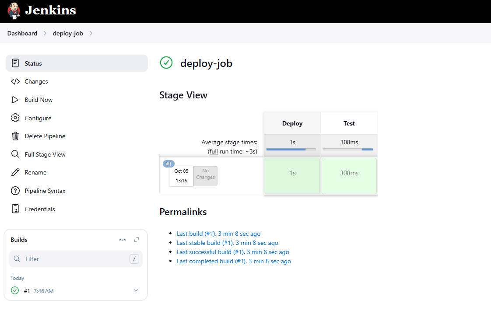

Click on the `Jenkins` button on the top bar to access the Jenkins UI. Login using username `admin` and password `Adm!n321`.

Similarly, click on the `Gitea` button on the top bar to access the Gitea UI. Login using username `sarah` and password `Sarah_pass123`.

There is a repository named `sarah/web` in Gitea that is already cloned on `Storage server` under `/var/www/html` directory.

1. Update the content of the file `index.html` under the same repository to `Welcome to xFusionCorp Industries` and push the changes to the origin into the `master` branch.
2. Apache is already installed on all app Servers its running on port `8080`.
3. Create a Jenkins pipeline job named `deploy-job` (it must not be a `Multibranch pipeline` job) and pipeline should have two stages `Deploy` and `Test` ( names are case sensitive ). Configure these stages as per details mentioned below.

    a. The `Deploy` stage should deploy the code from `web` repository under `/var/www/html` on the `Storage Server`, as this location is already mounted to the document root `/var/www/html` of all app servers.

    b. The `Test` stage should just test if the app is working fine and website is accessible. Its up to you how you design this stage to test it out, you can simply add a `curl` command as well to run a curl against the LBR URL (`http://stlb01:8091`) to see if the website is working or not. Make sure this stage fails in case the website/app is not working or if the `Deploy` stage fails.

---

# Solution:


##  First install the Essential Plugins:

1. **Pipeline**(also called "Workflow Aggregator")
    - This is the core plugin for Jenkins Pipeline
    - Usually comes pre-installed with modern Jenkins installations
2. **Pipeline: Stage View**
    - Provides the visual stage view in the build page
    - Helps you see Deploy and Test stages visually


###  Create the Jenkins Pipeline Job:

1. Log into Jenkins web interface (username: `jenkins`, password: `j@rv!s`)
2. Click **New Item**
3. Enter name: `deploy-job`
4. Select **Pipeline** (NOT Multibranch Pipeline)
5. Click **OK**
6. In the configuration page:
    - **Pipeline section**: Select **Pipeline script**
    - Paste the pipeline script provided above
7. Click **Save**

```

pipeline {
    agent any

    stages {
        stage('Deploy') {
            steps {
                script {
                    sh '''
                        sshpass -p 'Bl@kW' ssh -o StrictHostKeyChecking=no natasha@ststor01 "
                            cd /var/www/html &&
                            sudo rm -rf * &&
                            sudo git clone http://git.stratos.xfusioncorp.com/sarah/web.git . &&
                            echo 'Deployment completed successfully'
                        "
                    '''
                }
            }
        }

        stage('Test') {
            steps {
                script {
                    sh '''
                        response=\$(curl -s -o /dev/null -w "%{http_code}" http://stlb01:8091)
                        if [ \$response -eq 200 ]; then
                            echo "Website is accessible. HTTP Status: \$response"
                            content=\$(curl -s http://stlb01:8091)
                            echo "Content: \$content"
                            if echo "\$content" | grep -q "Welcome to xFusionCorp Industries"; then
                                echo "Test Passed: Correct content found"
                            else
                                echo "Test Failed: Expected content not found"
                                exit 1
                            fi
                        else
                            echo "Test Failed: Website returned HTTP Status: \$response"
                            exit 1
                        fi
                    '''
                }
            }
        }
    }
}
```



This simplified version:

- **Deploy stage**: Deploys the code to the storage server
- **Test stage**: Simply runs `curl -I` to check if the load balancer returns HTTP headers (which will fail the stage if the website is down)

The `curl -I` command will automatically fail (exit code non-zero) if the connection fails, which will cause the Test stage to fail as required.