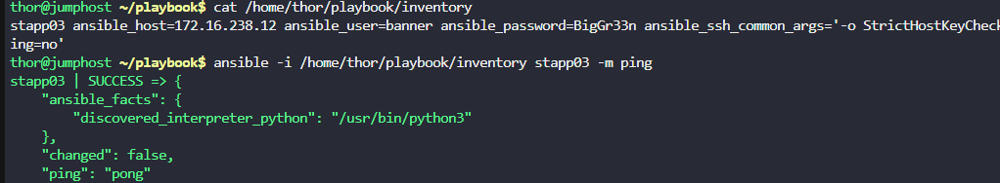
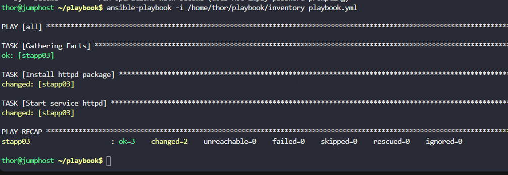

The Nautilus DevOps team is testing Ansible playbooks on various servers within their stack. They've placed some playbooks under `/home/thor/playbook/` directory on the `jump host` and now intend to test them on `app server 3` in `Stratos DC`. However, an inventory file needs creation for Ansible to connect to the respective app. Here are the requirements:

a. Create an ini type Ansible inventory file `/home/thor/playbook/inventory` on `jump host`.

b. Include `App Server 3` in this inventory along with necessary variables for proper functionality.

c. Ensure the inventory hostname corresponds to the `server name` as per the wiki, for example `stapp01` for `app server 1` in `Stratos DC`.

---

# Solution:
To create the Ansible inventory file for App Server 3, follow these steps:
1. SSH into the jump host.
2. Create the inventory file at `/home/thor/playbook/inventory` with the following content:
```
cat > /home/thor/playbook/inventory << 'EOF'
stapp03 ansible_host=172.16.238.12 ansible_user=banner ansible_password=BigGr33n ansible_ssh_common_args='-o StrictHostKeyChecking=no'
EOF
```


The inventory file contains:

- **stapp03**: The inventory hostname (matches the server name from the wiki)
- **ansible_host=172.16.238.12**: The IP address of App Server 3
- **ansible_user=banner**: The SSH username for App Server 3
- **ansible_password=BigGr33n**: The password for the banner user
- **ansible_ssh_common_args='-o StrictHostKeyChecking=no'**: Disables SSH host key checking (useful for lab environments)


```
ansible -i /home/thor/playbook/inventory stapp03 -m ping

ansible-playbook -i /home/thor/playbook/inventory /home/thor/playbook/playbook.yml
```


