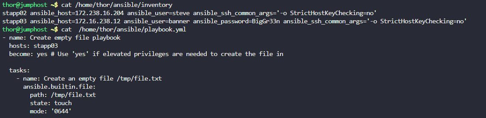
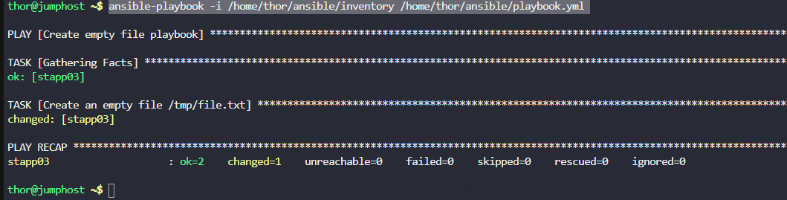

Troubleshoot and Create Ansible Playbook
---

# Solution:
To create an Ansible playbook that creates an empty file `/tmp/file.txt` on `App Server 3`, follow these steps:
1. SSH into the jump host.
2. Create the playbook file at `/home/thor/ansible/playbook.yml` with the following content:
```
cat > /home/thor/ansible/playbook.yml << 'EOF'
---
- name: Create empty file playbook
  hosts: stapp03
  become: yes # Use 'yes' if elevated privileges are needed to create the file in

  tasks:
    - name: Create an empty file /tmp/file.txt
      ansible.builtin.file:
        path: /tmp/file.txt
        state: touch
        mode: '0644'
EOF
```
The playbook contains:
- **hosts: stapp03**: Specifies the target host (App Server 3)
- **become: yes**: Ensures the tasks are run with elevated privileges (if necessary)
- **ansible.builtin.file**: Uses the file module to manage file properties
- **state: touch**: Creates an empty file if it doesn't exist
- **mode: '0644'**: Sets the file permissions

3. Add Stapp03 into the inventory.

```
stapp03 ansible_host=172.16.238.12 ansible_user=banner ansible_password=BigGr33n ansible_ssh_common_args='-o StrictHostKeyChecking=no'
```





```
ansible -i /home/thor/ansible/inventory stapp03 -m ping

ansible-playbook -i /home/thor/ansible/inventory /home/thor/ansible/playbook.yml
```
