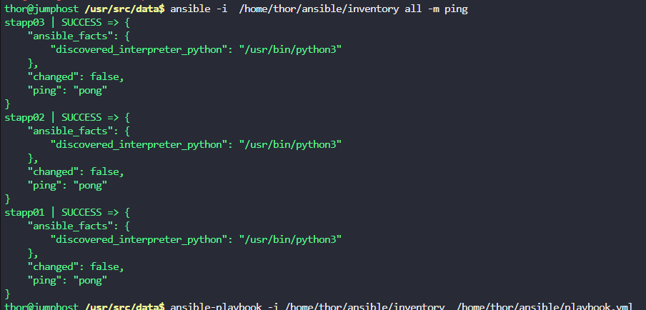

The Nautilus DevOps team needs to copy data from the `jump host` to all `application servers` in `Stratos DC` using Ansible. Execute the task with the following details:

a. Create an inventory file `/home/thor/ansible/inventory` on `jump_host` and add all application servers as managed nodes.

b. Create a playbook `/home/thor/ansible/playbook.yml` on the `jump host` to copy the `/usr/src/data/index.html` file to all application servers, placing it at `/opt/data`.

`Note:` Validation will run the playbook using the command `ansible-playbook -i inventory playbook.yml`. Ensure the playbook functions properly without any extra arguments.

---

# Solution:
## Step 1: Create the Inventory File
1. Log in to the `jump host`.
2. Create the directory for Ansible if it doesn't exist:
   ```bash
   mkdir -p /home/thor/ansible
   ```
3. Create the inventory file:
   ```bash
    nano /home/thor/ansible/inventory
    ```
4. Add the application servers to the inventory file. For example:
```
stapp03 ansible_host=172.16.238.12 ansible_user=banner ansible_password=BigGr33n ansible_ssh_common_args='-o StrictHostKeyChecking=no'
stapp02 ansible_host=172.16.238.11 ansible_user=steve ansible_password=Am3ric@ ansible_ssh_common_args='-o StrictHostKeyChecking=no'
stapp01 ansible_host=172.16.238.10 ansible_user=tony ansible_password=	Ir0nM@n ansible_ssh_common_args='-o StrictHostKeyChecking=no'
```
5. Save and exit the file.
## Step 2: Create the Playbook
1. Create the playbook file:
   ```bash
   nano /home/thor/ansible/playbook.yml
   ```
2. Add the following content to the playbook:
   ```yaml
- name: Copy index.html to application servers
  hosts: all
  become: yes
  tasks:
    - name: Ensure /opt/data directory exists
      ansible.builtin.file:
        path: /opt/data
        state: directory

    - name: Copy index.html to /opt/data
      ansible.builtin.copy:
        src: /usr/src/data/index.html
        dest: /opt/data/
```
3. Save and exit the file.
## Step 3: Run the Playbook
1. Navigate to the Ansible directory:
   ```bash
   cd /home/thor/ansible
   ```
2. Run the playbook:
   ```bash
    ansible-playbook -i inventory playbook.yml
    ```



