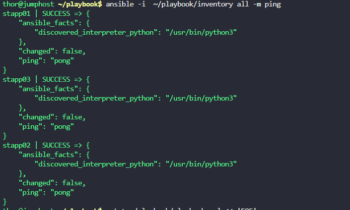
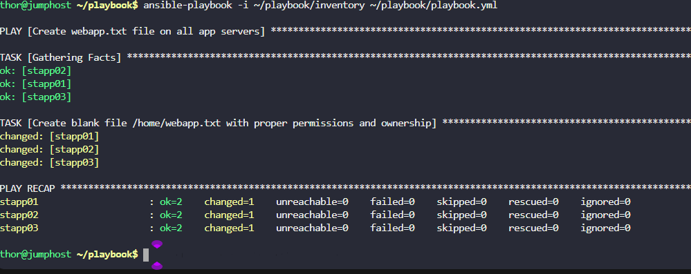

The Nautilus DevOps team is testing various Ansible modules on servers in `Stratos DC`. They're currently focusing on file creation on remote hosts using Ansible. Here are the details:

a. Create an inventory file `~/playbook/inventory` on `jump host` and include `all app servers`.

b. Create a playbook `~/playbook/playbook.yml` to create a blank file `/home/webapp.txt` on `all app servers`.

c. Set the permissions of the `/home/webapp.txt` file to `0644`.

d. Ensure the user/group owner of the `/home/webapp.txt` file is `tony` on `app server 1`, `steve` on `app server 2` and `banner` on `app server 3`.

---

# Solution:

Step 1: Create the Inventory File

```
cd ~/playbook

cat > ~/playbook/inventory << 'EOF'
stapp01 ansible_host=172.16.238.10 ansible_user=tony ansible_password=Ir0nM@n ansible_ssh_common_args='-o StrictHostKeyChecking=no'
stapp02 ansible_host=172.16.238.11 ansible_user=steve ansible_password=Am3ric@ ansible_ssh_common_args='-o StrictHostKeyChecking=no'
stapp03 ansible_host=172.16.238.12 ansible_user=banner ansible_password=BigGr33n ansible_ssh_common_args='-o StrictHostKeyChecking=no'
EOF
```



```
cat > ~/playbook/playbook.yml << 'EOF'
---
- name: Create webapp.txt file on all app servers
  hosts: all
  become: yes
  tasks:
    - name: Create blank file /home/webapp.txt with proper permissions and ownership
      file:
        path: /home/webapp.txt
        state: touch
        mode: '0644'
        owner: "{{ ansible_user }}"
        group: "{{ ansible_user }}"
EOF
```
Step 2: Run the Playbook

```
ansible -i ~/playbook/inventory all -m ping
ansible-playbook -i ~/playbook/inventory ~/playbook/playbook.yml
```
