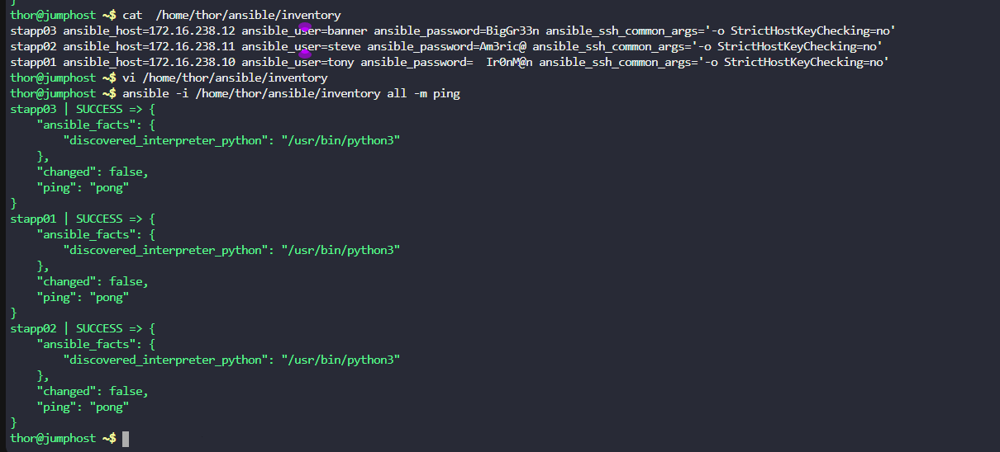

a. `Jump host` is our Ansible controller, and we are going to run Ansible playbooks through `thor` user from `jump host`.

b. There is an inventory file `/home/thor/ansible/inventory` on `jump host`. Using that inventory file test `Ansible ping` from `jump host` to `App Server 1`, make sure ping works.

---

# Solution:

## Step 1: Verify Inventory File
1. Log in to the `jump host`.
2. Check the contents of the inventory file
    ```bash
    cat /home/thor/ansible/inventory
    ```


changing the inventory file to add `ansible_ssh_common_args='-o StrictHostKeyChecking=no'`.

```
stapp03 ansible_host=172.16.238.12 ansible_user=banner ansible_password=BigGr33n ansible_ssh_common_args='-o StrictHostKeyChecking=no'
stapp02 ansible_host=172.16.238.11 ansible_user=steve ansible_password=Am3ric@ ansible_ssh_common_args='-o StrictHostKeyChecking=no'
stapp01 ansible_host=172.16.238.10 ansible_user=tony ansible_password=Ir0nM@n ansible_ssh_common_args='-o StrictHostKeyChecking=no'
```
3. Save and exit the file.
## Step 2: Test Ansible Ping
1. Run the Ansible ping command to test connectivity to `App Server 1`:
   ```bash
   ansible -i /home/thor/ansible/inventory all -m ping
   ```


## The Problem with Ansible

When Ansible tries to connect to servers:

- It can't interactively type "yes"
- The playbook will **FAIL** if it encounters this prompt
- You'll get an error like: `Failed to connect to the host via ssh`

## Solutions:

### Option 1: Use `ansible_ssh_common_args` (What we did)

```
ansible_ssh_common_args='-o StrictHostKeyChecking=no'
```
