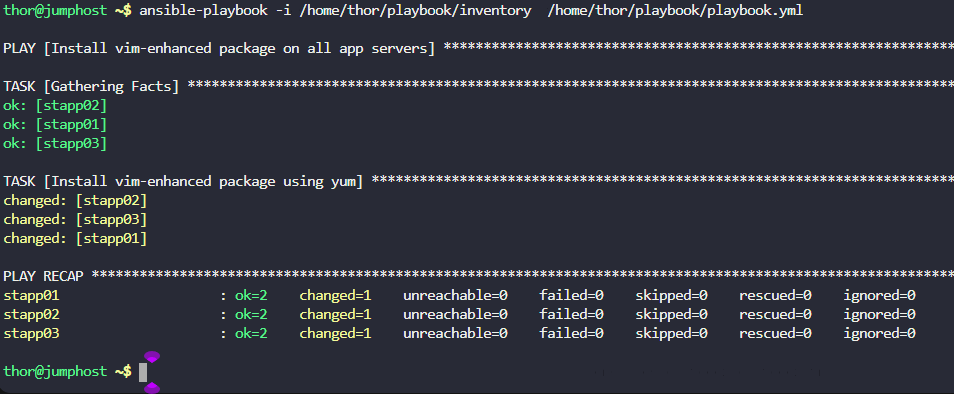

1. Create an inventory file `/home/thor/playbook/inventory` on `jump host` and add all app servers in it.
2. Create an Ansible playbook `/home/thor/playbook/playbook.yml` to install `vim-enhanced` package on `all app servers` using Ansible `yum` module.
3. Make sure user `thor` should be able to run the playbook on `jump host`.

---

# Solution:

## Create the Inventory and the playbook

```
stapp03 ansible_host=172.16.238.12 ansible_user=banner ansible_password=BigGr33n ansible_ssh_common_args='-o StrictHostKeyChecking=no'
stapp02 ansible_host=172.16.238.11 ansible_user=steve ansible_password=Am3ric@ ansible_ssh_common_args='-o StrictHostKeyChecking=no'
stapp01 ansible_host=172.16.238.10 ansible_user=tony ansible_password=Ir0nM@n ansible_ssh_common_args='-o StrictHostKeyChecking=no'
```
```playbook

- name: Install vim-enhanced package on all app servers
  hosts: all
  become: yes
  tasks:
    - name: Install vim-enhanced package using yum
      yum:
        name: vim-enhanced
        state: present

```
## Check Playbook Syntax


bash

    ansible-playbook -i /home/thor/playbook/inventory /home/thor/playbook/playbook.yml --syntax-check

##  Run the Playbook


bash

    ansible-playbook -i /home/thor/playbook/inventory /home/thor/playbook/playbook.yml

