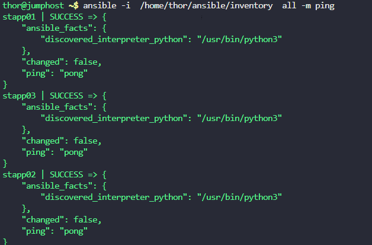
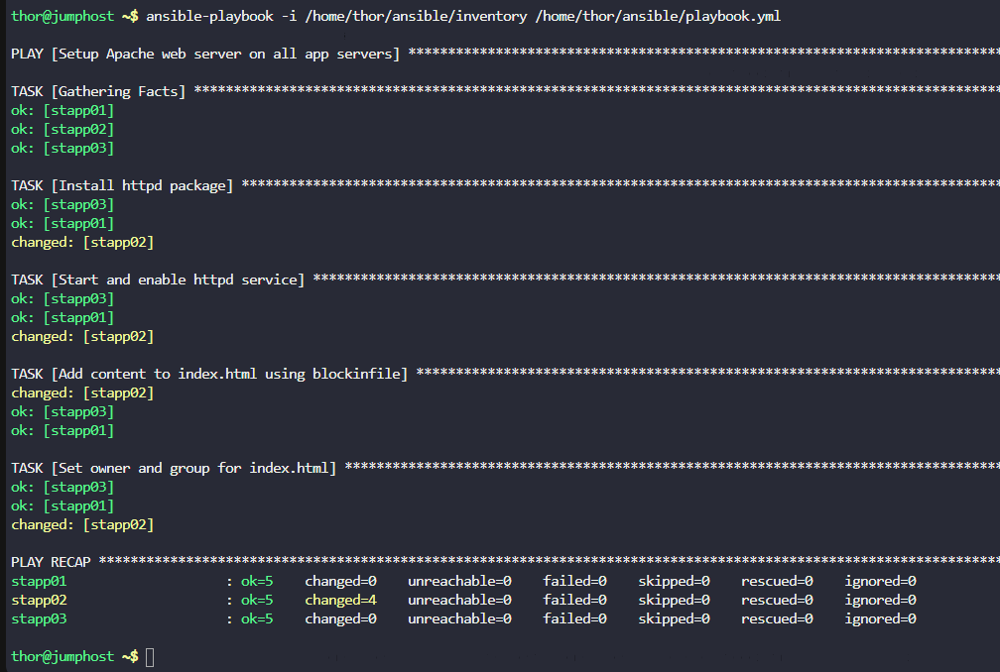

1. Using the playbook, install `httpd` web server on all app servers. Additionally, make sure its service should up and running.
2. Using `blockinfile` Ansible module add some content in `/var/www/html/index.html` file. Below is the content:

    `Welcome to XfusionCorp!`

    `This is Nautilus sample file, created using Ansible!`

    `Please do not modify this file manually!`
3. The `/var/www/html/index.html` file's user and group `owner` should be `apache` on all app servers.
4. The `/var/www/html/index.html` file's permissions should be `0777` on all app servers.

---

# Solution:

## First check whether you are able to ping with the inventory



## Create a playbook with the below content and run it

```yaml
---
- name: Setup Apache web server on all app servers
  hosts: all
  become: yes
  tasks:
    - name: Install httpd package
      yum:
        name: httpd
        state: present

    - name: Start and enable httpd service
      service:
        name: httpd
        state: started
        enabled: yes

    - name: Add content to index.html using blockinfile
      blockinfile:
        path: /var/www/html/index.html
        create: yes
        block: |
          Welcome to XfusionCorp!
          This is Nautilus sample file, created using Ansible!
          Please do not modify this file manually!

    - name: Set owner and group for index.html
      file:
        path: /var/www/html/index.html
        owner: apache
        group: apache
        mode: '0777'
```
Check Playbook Syntax

```
ansible-playbook -i /home/thor/ansible/inventory /home/thor/ansible/playbook.yml --syntax-check

```
## Run the playbook

```bash
ansible-playbook -i /home/thor/ansible/inventory /home/thor/ansible/playbook.yml
```



### Add Content Using blockinfile


yaml

    - name: Add content to index.html using blockinfile
       blockinfile: path: /var/www/html/index.html
        create: yes
        block: |
        Welcome to XfusionCorp! This is Nautilus sample file, created using Ansible! Please do not modify this file manually!

- **blockinfile**: Module to insert/update/remove a block of lines
- **create: yes**: Creates the file if it doesn't exist
- **block**: Multi-line content to add (using `|` for literal block)