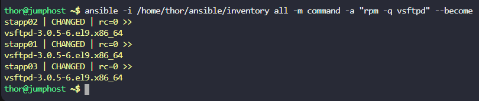

a. On `jump host` create an Ansible playbook `/home/thor/ansible/playbook.yml` and configure it to install `vsftpd` on all app servers.

b. After installation make sure to start and enable `vsftpd` service on all app servers.

c. The inventory `/home/thor/ansible/inventory` is already there on `jump host`.

d. Make sure user `thor` should be able to run the playbook on `jump host`.

---

# Solution:


```
---
- name: Setup Very Secure FTP server on all app servers
  hosts: all
  become: yes
  tasks:
    - name: Install vsftp package
      yum:
        name: vsftpd
        state: present

    - name: Start and enable vsftp service
      service:
        name: vsftpd
        state: started
        enabled: yes

```

## Verifying

```
ansible -i /home/thor/ansible/inventory all -m command -a "rpm -q vsftpd" --become
```


