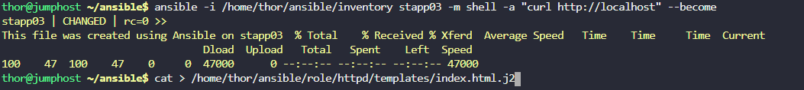
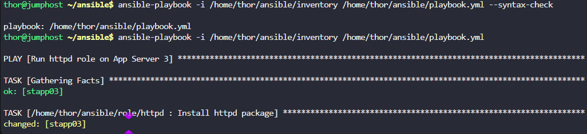

# Task-92 Managing Files Using Ansible Lineinfile Module

a. Update `~/ansible/playbook.yml` playbook to run the `httpd` role on `App Server 3`.

b. Create a jinja2 template `index.html.j2` under `/home/thor/ansible/role/httpd/templates/` directory and add a line `This file was created using Ansible on <respective server>` (for example `This file was created using Ansible on stapp01` in case of `App Server 1`). Also please make sure not to hard code the server name inside the template. Instead, use `inventory_hostname` variable to fetch the correct value.

c. Add a task inside `/home/thor/ansible/role/httpd/tasks/main.yml` to copy this template on `App Server 3` under `/var/www/html/index.html`. Also make sure that `/var/www/html/index.html` file's permissions are `0755`.

d. The user/group owner of `/var/www/html/index.html` file must be respective sudo user of the server (for example `tony` in case of `stapp01`).


---

# Solution:


## Step 1: Create the httpd role directory structure

    mkdir -p /home/thor/ansible/role/httpd/{tasks,templates}cd /home/thor/ansible

## Step 2: Create the Jinja2 template

    cat > /home/thor/ansible/role/httpd/templates/index.html.j2 << 'EOF'
    This file was created using Ansible on {{ inventory_hostname }}EOF

## Step 3: Create the tasks file for the httpd role

    cat > /home/thor/ansible/role/httpd/tasks/main.yml << 'EOF'
    ---
    - name: Install httpd package
    yum:
      name: httpd
      state: present

    - name: Start and enable httpd service
    service:
      name: httpd
      state: started
      enabled: yes

    - name: Deploy index.html from template
    template:
      src: index.html.j2
      dest: /var/www/html/index.html
      owner: "{{ ansible_user }}"
      group: "{{ ansible_user }}"
      mode: '0755'
    EOF

## Step 4: Create/Update the main playbook

    cat > /home/thor/ansible/playbook.yml << 'EOF'---
    - name: Run httpd role on App Server 3
      hosts: stapp03
      become: yes
      roles:
       - role: /home/thor/ansible/role/httpd
      EOF


## Step 5: Check playbook syntax

    ansible-playbook -i /home/thor/ansible/inventory /home/thor/ansible/playbook.yml --syntax-check

## Step 6: Run the playbook

    ansible-playbook -i /home/thor/ansible/inventory /home/thor/ansible/playbook.yml

## Step 8: Verify the deployment
```
 # Test the web server
    ansible -i /home/thor/ansible/inventory stapp03 -m shell -a "curl http://localhost" --become
```


## Explanation:

### 1. Jinja2 Template (`index.html.j2`)

    This file was created using Ansible on {{ inventory_hostname }}

- **{{ inventory\_hostname }}**: Ansible variable that contains the hostname from inventory
- For stapp03, it will render as: `This file was created using Ansible on stapp03`

### 2. Role Tasks File (`tasks/main.yml`)

    - name: Deploy index.html from template
      template:
         src: index.html.j2 # Template file (searches in templates/ directory)
         dest: /var/www/html/index.html # Destination on target server
         owner: "{{ ansible_user }}" # Owner = ansible_user (banner for stapp03)
         group: "{{ ansible_user }}" # Group = ansible_user (banner for stapp03)
         mode: '0755' # Permissions: rwxr-xr-x

### 3. Main Playbook (`playbook.yml`)

    ---
    - name: Run httpd role on App Server 3
      hosts: stapp03 # Target only App Server 3
      become: yes # Use sudo
      roles:
       - role: /home/thor/ansible/role/httpd # Use the httpd role

## Understanding Key Ansible Variables:

| Variable | Description | Value for stapp03 |
| --- | --- | --- |
| `{{ inventory_hostname }}` | Hostname from inventory | `stapp03` |
| `{{ ansible_user }}` | SSH user from inventory | `banner` |
| `{{ ansible_host }}` | IP address from inventory | `172.16.238.12` |

