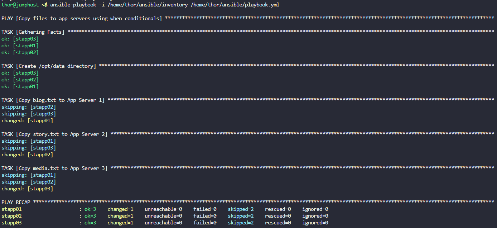
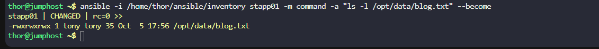

# Task-93  Using Ansible Conditionals
An `inventory` file is already placed under `/home/thor/ansible` directory on `jump host`, with all the `Stratos DC app servers` included.

Create a playbook `/home/thor/ansible/playbook.yml` and make sure to use Ansible's `when` conditionals statements to perform the below given tasks.

1. Copy `blog.txt` file present under `/usr/src/data` directory on `jump host` to `App Server 1` under `/opt/data` directory. Its user and group owner must be user `tony` and its permissions must be `0777` .
2. Copy `story.txt` file present under `/usr/src/data` directory on `jump host` to `App Server 2` under `/opt/data` directory. Its user and group owner must be user `steve` and its permissions must be `0777` .
3. Copy `media.txt` file present under `/usr/src/data` directory on `jump host` to `App Server 3` under `/opt/data` directory. Its user and group owner must be user `banner` and its permissions must be `0777`.

---

# Solution

## Step 1: Navigate to the ansible directory

```bash
cd /home/thor/ansible
```

## Step 2: Create the playbook with when conditionals

```bash
cat > /home/thor/ansible/playbook.yml << 'EOF'
---
- name: Copy files to app servers using when conditionals
  hosts: all
  become: yes
  tasks:
    - name: Create /opt/data directory
      file:
        path: /opt/data
        state: directory
        mode: '0755'

    - name: Copy blog.txt to App Server 1
      copy:
        src: /usr/src/data/blog.txt
        dest: /opt/data/blog.txt
        owner: tony
        group: tony
        mode: '0777'
      when: inventory_hostname == 'stapp01'

    - name: Copy story.txt to App Server 2
      copy:
        src: /usr/src/data/story.txt
        dest: /opt/data/story.txt
        owner: steve
        group: steve
        mode: '0777'
      when: inventory_hostname == 'stapp02'

    - name: Copy media.txt to App Server 3
      copy:
        src: /usr/src/data/media.txt
        dest: /opt/data/media.txt
        owner: banner
        group: banner
        mode: '0777'
      when: inventory_hostname == 'stapp03'
EOF
```


## Step 3: Check playbook syntax

```bash
ansible-playbook -i /home/thor/ansible/inventory /home/thor/ansible/playbook.yml --syntax-check
```

## Step 4: Run the playbook

```bash
ansible-playbook -i /home/thor/ansible/inventory /home/thor/ansible/playbook.yml
```


## Step 5: Verify the deployment

```bash
# Check blog.txt on App Server 1
ansible -i /home/thor/ansible/inventory stapp01 -m command -a "ls -l /opt/data/blog.txt" --become

```



## Explanation of When Conditionals:

### Task Structure with When Conditional:
```yaml
- name: Copy blog.txt to App Server 1
  copy:
    src: /usr/src/data/blog.txt
    dest: /opt/data/blog.txt
    owner: tony
    group: tony
    mode: '0777'
  when: inventory_hostname == 'stapp01'
```

### How `when` Works:
- **when: inventory_hostname == 'stapp01'**: This task only runs when the target host is `stapp01`
- For `stapp02` and `stapp03`, this task is **skipped**
- Each server only receives its designated file

### Conditional Operators Available:
```yaml
# Equality
when: inventory_hostname == 'stapp01'

# Inequality
when: inventory_hostname != 'stapp01'

# Multiple conditions (AND)
when:
  - inventory_hostname == 'stapp01'
  - ansible_distribution == 'CentOS'

# Multiple conditions (OR)
when: inventory_hostname == 'stapp01' or inventory_hostname == 'stapp02'

# Check if variable is defined
when: my_variable is defined

# Check if variable exists and has value
when: my_variable is defined and my_variable == 'value'
```


