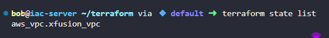

# Task-94  Create VPC Using Terraform


Create a VPC named `xfusion-vpc` in region `us-east-1` with any `IPv4` CIDR block through terraform.

The Terraform working directory is `/home/bob/terraform`. Create the `main.tf` file (do not create a different `.tf` file) to accomplish this task.

---

# Solution:

- ## Create the main Terraform configuration file

```

# Create VPC
resource "aws_vpc" "xfusion_vpc" {
  cidr_block           = "10.0.0.0/16"
  enable_dns_hostnames = true
  enable_dns_support   = true

  tags = {
    Name = "xfusion-vpc"
  }

```
Terraform Command

```
terraform init
terraform plan
terraform apply
```

- Since the provider has been already provided with the region as `us-east-1` we don't need to mentioned in the main.tf

- Verify by using terraform state list

