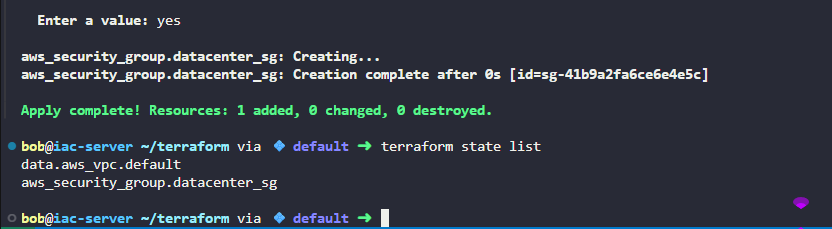

# Task-95

Use **Terraform** to create a security group under the default VPC with the following requirements:

1) The name of the security group must be `datacenter-sg`.

2) The description must be `Security group for Nautilus App Servers`.

3) Add an **inbound rule** of type `HTTP`, with a port range of `80`, and source CIDR range `0.0.0.0/0`.

4) Add another **inbound rule** of type `SSH`, with a port range of `22`, and source CIDR range `0.0.0.0/0`.


---

# Solution:


```hcl
data "aws_vpc" "default" {
  default = true
}
resource "aws_security_group" "datacenter_sg" {
  name        = "datacenter-sg"
  description = "Security group for Nautilus App Servers"
  vpc_id      = data.aws_vpc.default.id

  ingress {
    from_port   = 80
    to_port     = 80
    protocol    = "tcp"
    cidr_blocks = ["0.0.0.0/0]
    description = "Allow HTTP traffic"
    }
    ingress {
    from_port   = 22
    to_port     = 22
    protocol    = "tcp"
    cidr_blocks = ["0.0.0.0/0]
    description = "Allow SSH traffic"
    }
}

```
Terraform Command

```
terraform init
terraform plan
terraform apply
```


