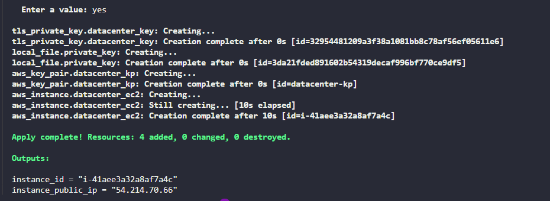

# Task-96 Create EC2 Instance Using Terraform

For this task, create an EC2 instance using `Terraform` with the following requirements:

1. The name of the instance must be `datacenter-ec2`.
2. Use the `Amazon Linux` `ami-0c101f26f147fa7fd` to launch this instance.
3. The Instance type must be `t2.micro`.
4. Create a new RSA key named `datacenter-kp`.
5. Attach the default (available by default) security group.


---

# Solution:


```
# Configure the AWS Provider
provider "aws" {
  region = "us-east-1"
}

# Create RSA Key Pair
resource "tls_private_key" "datacenter_key" {
  algorithm = "RSA"
  rsa_bits  = 2048
}

# Create AWS Key Pair
resource "aws_key_pair" "datacenter_kp" {
  key_name   = "datacenter-kp"
  public_key = tls_private_key.datacenter_key.public_key_openssh
}

# Save private key locally
resource "local_file" "private_key" {
  content         = tls_private_key.datacenter_key.private_key_pem
  filename        = "${path.module}/datacenter-kp.pem"
  file_permission = "0400"
}

# Get default VPC
data "aws_vpc" "default" {
  default = true
}

# Get default security group
data "aws_security_group" "default" {
  vpc_id = data.aws_vpc.default.id
  name   = "default"
}

# Create EC2 Instance
resource "aws_instance" "datacenter_ec2" {
  ami                    = "ami-0c101f26f147fa7fd"
  instance_type          = "t2.micro"
  key_name               = aws_key_pair.datacenter_kp.key_name
  vpc_security_group_ids = [data.aws_security_group.default.id]

  tags = {
    Name = "datacenter-ec2"
  }
}

output "instance_id" {
  description = "ID of the EC2 instance"
  value       = aws_instance.datacenter_ec2.id
}

output "instance_public_ip" {
  description = "Public IP address of the EC2 instance"
  value       = aws_instance.datacenter_ec2.public_ip
}
```


