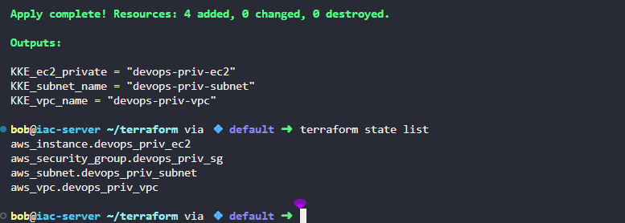

# Task-98

1. Create a VPC named `devops-priv-vpc` with the CIDR block `10.0.0.0/16`.
2. Create a subnet named `devops-priv-subnet` inside the VPC with the CIDR block `10.0.1.0/24` and `auto-assign` IP option must not be `enabled`.
3. Create an EC2 instance named `devops-priv-ec2` inside the subnet and instance type must be `t2.micro`.
4. Ensure the security group of the EC2 instance allows access only from within the VPC's CIDR block.
5. Create the `main.tf` file (do not create a separate `.tf` file) to provision the VPC, subnet and EC2 instance.
6. Use `variables.tf` file with the following variable names:

    - `KKE_VPC_CIDR` for the VPC CIDR block.
    - `KKE_SUBNET_CIDR` for the subnet CIDR block.
7. Use the `outputs.tf` file with the following variable names:

    - `KKE_vpc_name` for the name of the VPC.
    - `KKE_subnet_name` for the name of the subnet.
    - `KKE_ec2_private` for the name of the EC2 instance.

---

# Solution:

* * *

### 🟩 **main.tf**

```
provider "aws" {
  region = "us-east-1"  # You can change this as needed
}

# ------------------------
# Create VPC
# ------------------------
resource "aws_vpc" "devops_priv_vpc" {
  cidr_block           = var.KKE_VPC_CIDR
  enable_dns_support   = true
  enable_dns_hostnames = true

  tags = {
    Name = "devops-priv-vpc"
  }
}

# ------------------------
# Create Subnet
# ------------------------
resource "aws_subnet" "devops_priv_subnet" {
  vpc_id                  = aws_vpc.devops_priv_vpc.id
  cidr_block              = var.KKE_SUBNET_CIDR
  map_public_ip_on_launch = false  # Auto-assign IP option disabled

  tags = {
    Name = "devops-priv-subnet"
  }
}

# ------------------------
# Create Security Group
# ------------------------
resource "aws_security_group" "devops_priv_sg" {
  name        = "devops-priv-sg"
  description = "Allow access only within VPC CIDR"
  vpc_id      = aws_vpc.devops_priv_vpc.id

  ingress {
    description = "Allow all traffic from within VPC"
    from_port   = 0
    to_port     = 0
    protocol    = "-1"
    cidr_blocks = [var.KKE_VPC_CIDR]
  }

  egress {
    description = "Allow all outbound traffic within VPC"
    from_port   = 0
    to_port     = 0
    protocol    = "-1"
    cidr_blocks = [var.KKE_VPC_CIDR]
  }

  tags = {
    Name = "devops-priv-sg"
  }
}

# ------------------------
# Create EC2 Instance
# ------------------------
resource "aws_instance" "devops_priv_ec2" {
  ami           = "ami-0c55b159cbfafe1f0" # Amazon Linux 2 AMI (example, update if needed)
  instance_type = "t2.micro"
  subnet_id     = aws_subnet.devops_priv_subnet.id
  vpc_security_group_ids = [aws_security_group.devops_priv_sg.id]

  tags = {
    Name = "devops-priv-ec2"
  }
}
```


### 🟨 **variables.tf**

```
variable "KKE_VPC_CIDR" {
  description = "CIDR block for the VPC"
  type        = string
  default     = "10.0.0.0/16"
}

variable "KKE_SUBNET_CIDR" {
  description = "CIDR block for the Subnet"
  type        = string
  default     = "10.0.1.0/24"
}
```


### 🟦 **outputs.tf**

```
output "KKE_vpc_name" {
  description = "Name of the VPC"
  value       = aws_vpc.devops_priv_vpc.tags["Name"]
}

output "KKE_subnet_name" {
  description = "Name of the Subnet"
  value       = aws_subnet.devops_priv_subnet.tags["Name"]
}

output "KKE_ec2_private" {
  description = "Name of the EC2 instance"
  value       = aws_instance.devops_priv_ec2.tags["Name"]
}
```


