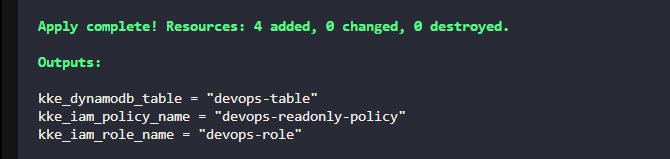
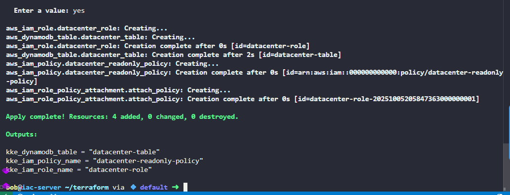

# Task-99

1. **Create a DynamoDB Table:** Create a table named `datacenter-table` with minimal configuration.
2. **Create an IAM Role:** Create an IAM role named `datacenter-role` that will be allowed to access the table.
3. **Create an IAM Policy:** Create a policy named `datacenter-readonly-policy` that should grant read-only access (GetItem, Scan, Query) to the specific DynamoDB table and attach it to the role.
4. Create the `main.tf` file (do not create a separate `.tf` file) to provision the table, role, and policy.
5. Create the `variables.tf` file with the following variables:

    - `KKE_TABLE_NAME`: name of the DynamoDB table
    - `KKE_ROLE_NAME`: name of the IAM role
    - `KKE_POLICY_NAME`: name of the IAM policy
6. Create the `outputs.tf` file with the following outputs:

    - `kke_dynamodb_table`: name of the DynamoDB table
    - `kke_iam_role_name`: name of the IAM role
    - `kke_iam_policy_name`: name of the IAM policy
7. Define the actual values for these variables in the `terraform.tfvars` file.
8. Ensure that the `IAM policy` allows only read access and restricts it to the specific `DynamoDB table` created.


---

# Solution:
The solution for Task-99 involves creating a DynamoDB table, an IAM role, and an IAM policy using Terraform. Below is a complete example of how to achieve this.
## main.tf
```hcl
resource "aws_dynamodb_table" "datacenter_table" {
  name           = var.KKE_TABLE_NAME
  billing_mode   = "PAY_PER_REQUEST"
  hash_key       = "id"

  attribute {
    name = "id"
    type = "S"
  }
}
resource "aws_iam_role" "datacenter_role" {
  name = var.KKE_ROLE_NAME

  assume_role_policy = jsonencode({
    Version = "2012-10-17"
    Statement = [
      {
        Action = "sts:AssumeRole"
        Effect = "Allow"
        Principal = {
          Service = "ec2.amazonaws.com"
        }
      }
    ]
  })
}
resource "aws_iam_policy" "datacenter_readonly_policy" {
  name        = var.KKE_POLICY_NAME
  description = "Read-only access to DynamoDB table"

  policy = jsonencode({
    Version = "2012-10-17"
    Statement = [
      {
        Effect = "Allow"
        Action = [
          "dynamodb:GetItem",
          "dynamodb:Scan",
          "dynamodb:Query"
        ]
        Resource = aws_dynamodb_table.datacenter_table.arn
      }
    ]
  })
}
resource "aws_iam_role_policy_attachment" "attach_policy" {
  role       = aws_iam_role.datacenter_role.name
  policy_arn = aws_iam_policy.datacenter_readonly_policy.arn
}
```
## variables.tf
```hcl
variable "KKE_TABLE_NAME" {
  description = "Name of the DynamoDB table"
  type        = string
}
variable "KKE_ROLE_NAME" {
  description = "Name of the IAM role"
  type        = string
}
variable "KKE_POLICY_NAME" {
  description = "Name of the IAM policy"
  type        = string
}
```
## outputs.tf
```hcl
output "kke_dynamodb_table" {
  description = "Name of the DynamoDB table"
  value       = aws_dynamodb_table.datacenter_table.name
}
output "kke_iam_role_name" {
  description = "Name of the IAM role"
  value       = aws_iam_role.datacenter_role.name
}
output "kke_iam_policy_name" {
  description = "Name of the IAM policy"
  value       = aws_iam_policy.datacenter_readonly_policy.name
}
```
## terraform.tfvars
```hcl
KKE_TABLE_NAME  = "datacenter-table"
KKE_ROLE_NAME   = "datacenter-role"
KKE_POLICY_NAME = "datacenter-readonly-policy"
```


## Instructions to Run
1. Ensure you have Terraform installed and configured with AWS credentials.
2. Create the above files (`main.tf`, `variables.tf`, `outputs.tf`, `terraform.tfvars`) in a directory.
3. Navigate to the directory in your terminal.
4. Run `terraform init` to initialize the Terraform configuration.
5. Run `terraform apply` to create the resources. Review the plan and confirm by typing `yes`.
6. After the apply completes, you can check the outputs for the created resources.

# Explanation about variable.tf and terraform.tfvars. How main.tf works in this case
- `main.tf` contains the actual Terraform configuration that defines the resources to be created, such as the DynamoDB table, IAM role, and IAM policy. It uses the variables defined in `variables.tf` to make the configuration dynamic and reusable.
- `variables.tf` is used to declare the variables that will be used in the Terraform configuration. It defines the variable names, types, and descriptions.
- `terraform.tfvars` is used to provide the actual values for the variables declared in `variables.tf`. This file allows you to separate configuration from code, making it easier to manage different environments or settings without changing the main Terraform files.

